# HoverAI — Tài liệu Thiết kế Kiến trúc Hệ thống

> **Phiên bản mục tiêu:** 2.0.0 (full 5 modules)  
> **Cập nhật:** 2026-09-25  
> **Trạng thái triển khai:** Module 1–3 ✅ | Module 4–5 ❌ (chưa implement)

---

## 1. Tầm nhìn hệ thống

HoverAI là một **trợ lý duyệt web thông minh** hoạt động hoàn toàn trên máy cục bộ, theo mô hình **Privacy-First / BYOK (Bring Your Own Key)**:

- **Không có server trung tâm** — backend chạy tại `localhost:8000`, dữ liệu không đi ra ngoài
- **Không lưu API key phía backend** — key đi kèm mỗi request từ extension
- **100% local knowledge base** — lịch sử hội thoại lưu trong `chrome.storage.local`
- **Kích hoạt tự nhiên** — Alt + Hover trên bất kỳ link nào

---

## 2. Kiến trúc tổng thể (Target Architecture)

Sơ đồ dưới đây thể hiện **hệ thống đầy đủ theo thiết kế** bao gồm cả các phần chưa implement:

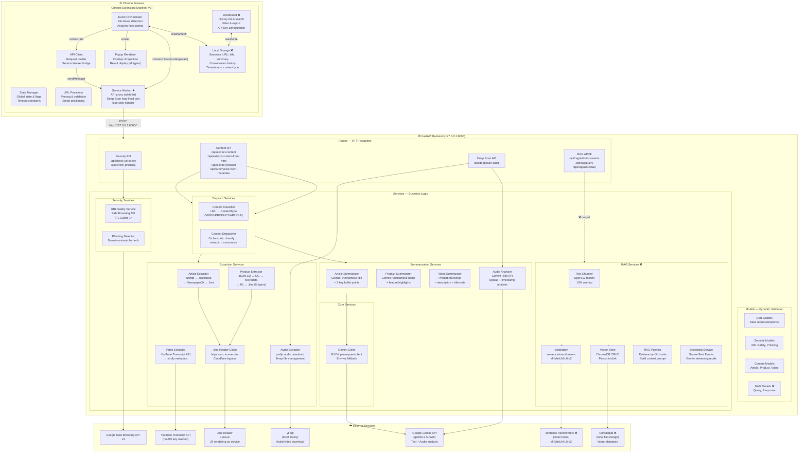

> **Ký hiệu:** ❌ = chưa implement, ★ = thành phần quan trọng nhất

---

## 3. Phân tầng kiến trúc Backend

```mermaid
flowchart LR
    subgraph T1["Tầng 1: HTTP Layer (Routes)"]
        direction TB
        RA["Security API"]
        RB["Content API"]
        RC["Deep Scan API"]
        RD["RAG API ❌"]
    end

    subgraph T2["Tầng 2: Validation Layer (Models)"]
        direction TB
        MA["Core Models\nBase, Health"]
        MB["Security Models\nURL Safety, Phishing"]
        MC["Content Models\nArticle, Product, Video"]
        MD["RAG Models ❌"]
    end

    subgraph T3["Tầng 3: Business Logic (Services)"]
        direction TB
        GA["Security Services\nURL Safety · Phishing Detector"]
        GB["Dispatch Services\nContent Classifier · Dispatcher"]
        GC["Extraction Services\nArticle · Product · Video · Audio · Jina"]
        GD["Summarization Services\nArticle · Product · Video · Audio Analyzer"]
        GE["RAG Services ❌\nChunker · Embedder · Vector Store · Pipeline · Streaming"]
        GF["Core Services\nGemini Client (BYOK)"]
    end

    T1 -->|"validate request"| T2
    T2 -->|"delegate to services"| T3
    T3 -->|"return Python dict"| T2
    T2 -->|"serialize JSON response"| T1
```

**Nguyên tắc:**
- Routes **không có business logic** — chỉ validate + delegate + HTTP error mapping
- Models đảm bảo **type safety** ở biên (input/output)
- Services **không biết về HTTP** — chỉ nhận/trả Python dict

---

## 4. Sơ đồ 5 Module

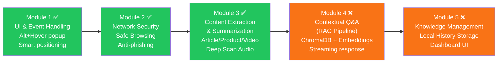

---

## 5. Frontend Architecture

### 5.1 Load order & responsibilities

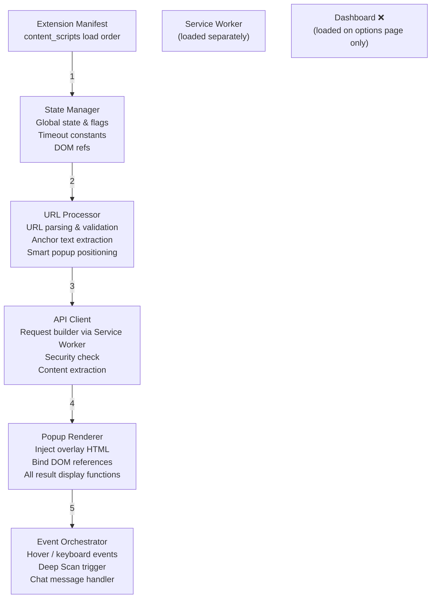

**Lý do chia module thay vì 1 file duy nhất:**
- Mỗi module có trách nhiệm riêng biệt (SRP)
- State Manager và URL Processor không phụ thuộc vào DOM — dùng lại được
- Dễ test từng phần độc lập

### 5.2 State management

Không có framework state — dùng **module-level globals** được khai báo tập trung trong State Manager:

| Biến | Kiểu | Mục đích |
|---|---|---|
| `isAltPressed` | `boolean` | Track phím Alt đang giữ |
| `lastHoveredLink` | `Element` | Tránh trigger lại cùng link |
| `hoverDebounceTimer` | `number` | ID của setTimeout 300ms |
| `analysisSequence` | `number` | Counter ngăn race condition |
| `currentLinkData` | `{href, text, domain}` | Dữ liệu link đang phân tích |
| `currentVideoUrl` | `string\|null` | URL video cho Deep Scan |
| `popup, statusIcon, ...` | `Element` | DOM refs (bind bởi Popup Renderer) |

### 5.3 Service Worker — Proxy Architecture

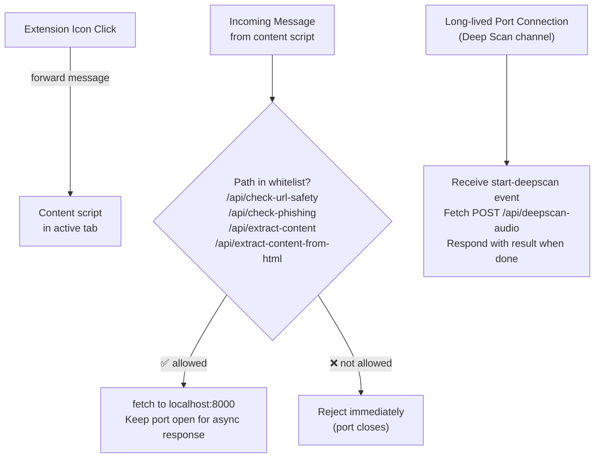

> **Tại sao Deep Scan dùng long-lived port thay vì message?**  
> Short message → port tự đóng sau ~5 phút chờ. Deep Scan mất 30–90s → cần long-lived port.  
> Fetch trực tiếp từ content script → TikTok/YouTube CSP chặn kết nối đến localhost.  
> → Service Worker không bị CSP của trang web → có thể fetch localhost tự do.

---

## 6. Content Processing Pipeline (Module 3)

### 6.1 Content Type Detection

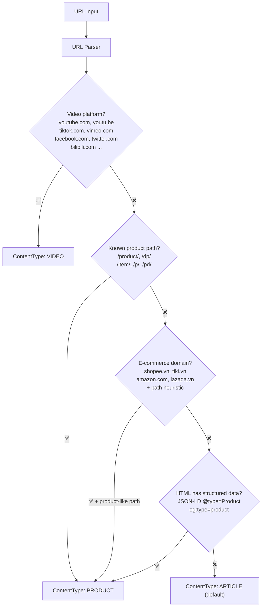

### 6.2 Article Extraction Pipeline

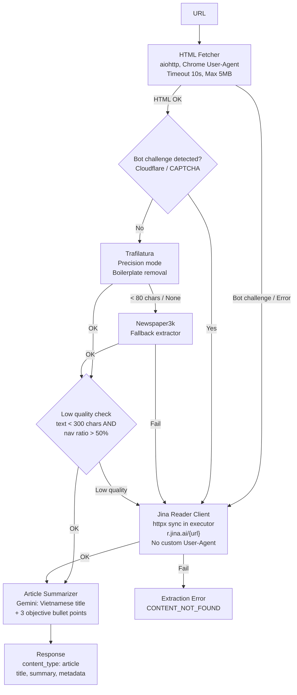

### 6.3 Product Extraction Pipeline (5 Layers)

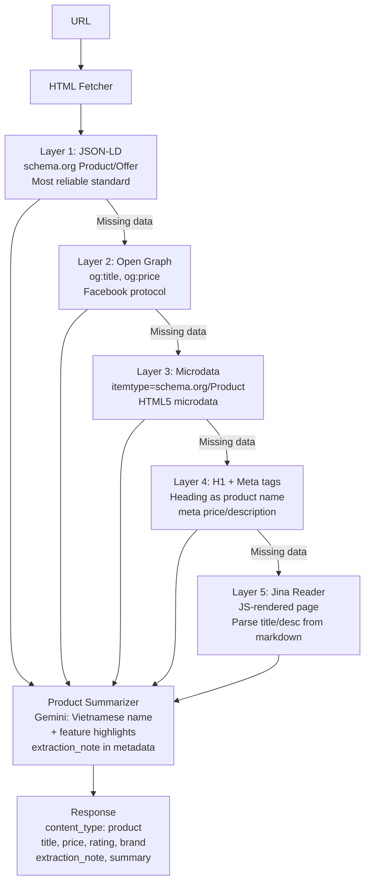

### 6.4 Video Processing Pipeline

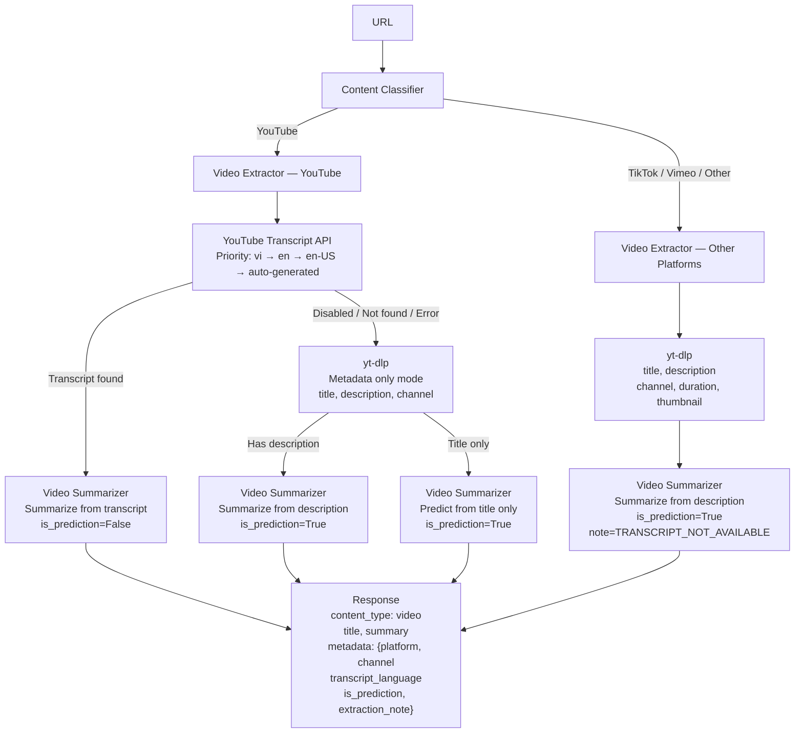

### 6.5 Deep Scan Audio Pipeline (FR3.5)

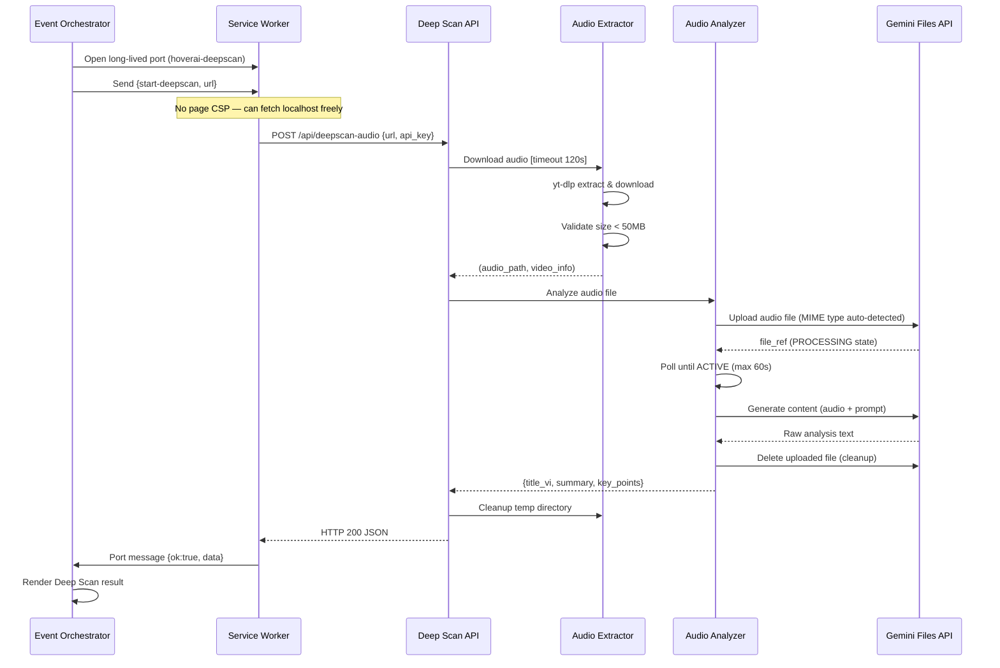

---

## 7. RAG Pipeline Architecture (Module 4 — Chưa implement)

```mermaid
flowchart TD
    subgraph Ingest["Ingestion Flow — khi phân tích link mới"]
        TXT["Extracted Text\n(Article / Product / Video)"] --> CHK["Text Chunker\nSplit into 512-token chunks\n10% overlap between chunks"]
        CHK --> EMB["Embedder\nsentence-transformers\nall-MiniLM-L6-v2 (384-dim)"]
        EMB --> VS["Vector Store\nChromaDB\nStore vectors + metadata\n(url, title, chunk_index)"]
    end

    subgraph Query["Query Flow — khi user gửi câu hỏi"]
        Q["User Question"] --> QEMB["Embedder\nConvert question to vector"]
        QEMB --> SRC["Vector Store\nCosine similarity search\nRetrieve top-3 relevant chunks"]
        SRC --> CTX["RAG Pipeline\nBuild prompt:\nSystem context + chunks + question"]
        CTX --> GEM["Gemini Client\nStreaming generation mode"]
        GEM --> SSE["Streaming Service\nServer-Sent Events\n/api/rag/ask endpoint"]
        SSE -->|"word-by-word stream"| UI["Popup Chat UI"]
    end
```

**Thiết kế ChromaDB:**
```
Collection: "hoverai_kb"
Document metadata:
  - url: string          # URL gốc của trang
  - title: string        # Tiêu đề trang
  - content_type: string # article | product | video
  - chunk_index: int     # Vị trí chunk trong tài liệu
  - created_at: timestamp
```

**Embedding model:** `all-MiniLM-L6-v2` — 384 chiều, chạy local, nhỏ (~80MB), tốt cho tiếng Anh và có hỗ trợ tiếng Việt cơ bản.

---

## 8. Knowledge Management Architecture (Module 5 — Chưa implement)

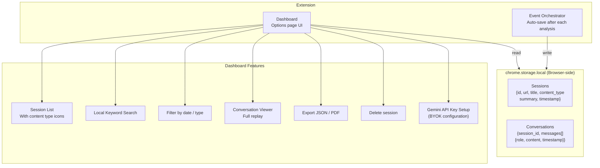

**Schema lưu trữ dự kiến:**
```javascript
// chrome.storage.local key: "hoverai_sessions"
[
  {
    id: "uuid-v4",
    url: "https://...",
    title: "Tiêu đề trang",
    content_type: "article" | "product" | "video",
    summary: "...",
    timestamp: 1234567890,
    messages: [
      { role: "user", content: "Câu hỏi...", timestamp: ... },
      { role: "ai",   content: "Trả lời...", timestamp: ... }
    ]
  }
]
```

---

## 9. Security Architecture

### 9.1 URL Safety Check

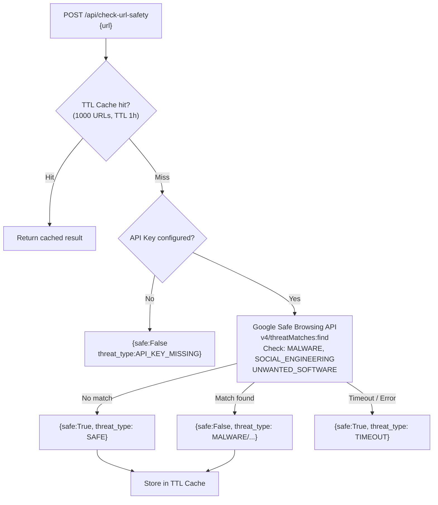

> `API_KEY_MISSING` → `safe:False` nhưng UI kiểm tra danh sách `cannotVerify` → hiện ⚠️ "Không thể xác minh" (không block user)

### 9.2 BYOK Security Flow

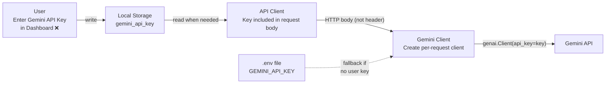

**Không có API key nào được:**
- Hardcode trong source code
- Lưu trong database phía server
- Ghi vào log file

---

## 10. API Endpoints — Full Reference

### Hiện có (Module 1–3)

| Method | Path | Request Body | Response | Module |
|--------|------|-------------|---------|--------|
| `GET` | `/api/health` | — | `{status, service, version}` | Core |
| `POST` | `/api/check-url-safety` | `{url}` | `{safe, threat_type}` | FR2.1 |
| `POST` | `/api/check-phishing` | `{href_url, anchor_text}` | `{is_phishing, mismatch_warning}` | FR2.2 |
| `POST` | `/api/extract-content` | `{url, gemini_api_key?}` | `ContentExtractionResponse` | FR3.1/3.2/3.3 |
| `POST` | `/api/extract-content-from-html` | `{url, html, page_title, gemini_api_key?}` | `ContentExtractionResponse` | FR3.1/3.2/3.3 |
| `POST` | `/api/extract-product` | `{url, html?, gemini_api_key?}` | `ProductExtractionResponse` | FR3.2 |
| `POST` | `/api/summarize-from-metadata` | `{title, description?, channel?, platform?, gemini_api_key?}` | `VideoMetadataResponse` | FR3.4 |
| `POST` | `/api/deepscan-audio` | `{url, gemini_api_key?}` | `DeepScanResponse` | FR3.5 |

### Kế hoạch (Module 4 — RAG)

| Method | Path | Request Body | Response | Module |
|--------|------|-------------|---------|--------|
| `POST` | `/api/rag/add-documents` | `{url, text, title, content_type, gemini_api_key?}` | `{chunks_added, collection_size}` | FR4.1 |
| `POST` | `/api/rag/query` | `{question, url?}` | `{chunks: [{text, score, metadata}]}` | FR4.2 |
| `POST` | `/api/rag/ask` | `{question, context_url?, gemini_api_key?}` | `SSE stream: text/event-stream` | FR4.3 |

### ContentExtractionResponse schema

```json
{
  "url": "string",
  "content_type": "article | product | video",
  "title": "string (Vietnamese if AI-normalized)",
  "text": "string (raw extracted text)",
  "summary": "string | null",
  "metadata": {
    "author": "string | null",
    "date": "string | null",
    "site_name": "string | null",
    "price": "number | null",
    "price_display": "string | null",
    "currency": "string | null",
    "rating": "number | null",
    "brand": "string | null",
    "review_count": "string | null",
    "extraction_note": "SPA_PARTIAL | JINA_PARTIAL | PRICE_NOT_AVAILABLE | TRANSCRIPT_DISABLED | TRANSCRIPT_NOT_FOUND | TRANSCRIPT_ERROR | TRANSCRIPT_NOT_AVAILABLE | null",
    "platform": "YouTube | TikTok | Vimeo | ...",
    "channel": "string | null",
    "transcript_language": "vi | en | null",
    "is_auto_generated": "boolean",
    "is_prediction": "boolean"
  }
}
```

---

## 11. Dependency & Tech Stack

### Backend

| Thư viện | Phiên bản | Mục đích | Module |
|---|---|---|---|
| `fastapi` | 0.104+ | Async web framework | Core |
| `uvicorn` | 0.24+ | ASGI server | Core |
| `pydantic` | 2.5+ | Validation & serialization | Core |
| `python-dotenv` | 1.0+ | Environment variable management | Core |
| `aiohttp` | 3.9+ | Async HTTP client (HTML fetching) | M3 |
| `httpx` | 0.27+ | Sync HTTP client (Jina Reader) | M3 |
| `trafilatura` | 1.6+ | Article text extraction | FR3.1 |
| `newspaper3k` | 0.9+ | Article extraction fallback | FR3.1 |
| `beautifulsoup4` | 4.12+ | HTML parsing (product extraction) | FR3.2 |
| `youtube-transcript-api` | 0.6+ | YouTube subtitle fetching | FR3.3 |
| `yt-dlp` | latest | Audio/video download | FR3.5 |
| `google-genai` | latest | Gemini API client | M3, M4 |
| `cachetools` | 5.3+ | TTL cache (Safe Browsing results) | FR2.1 |
| `sentence-transformers` | 2.2+ | Local text embeddings | FR4.1 ❌ |
| `chromadb` | 0.4+ | Local vector database | FR4.1 ❌ |

### Frontend

| Công nghệ | Mục đích |
|---|---|
| Chrome Extension Manifest V3 | Extension platform |
| JavaScript (Vanilla ES6+) | No bundler/framework needed |
| CSS3 | Popup styling |
| `chrome.storage.local` | Decentralized local history (M5 ❌) |
| `chrome.runtime.connect()` | Long-lived port for Deep Scan |
| `chrome.runtime.sendMessage()` | Standard short API calls |

---

## 12. Deployment Architecture

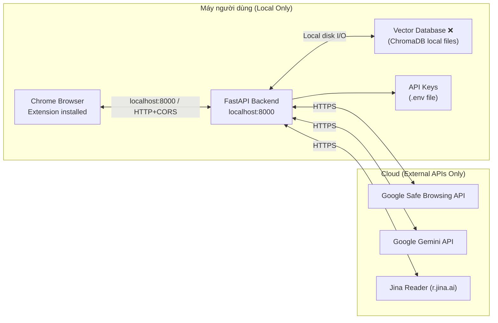

**Không có:**
- Cloud database
- User authentication / accounts
- Server-side session storage
- Analytics / telemetry

---

## 13. Design Decisions & Tradeoffs

| Quyết định | Lựa chọn | Lý do |
|---|---|---|
| Extension vs Web app | Chrome Extension | Cần truy cập DOM, chạy trên mọi trang |
| Backend framework | FastAPI | Async native, auto OpenAPI docs, Pydantic validation |
| AI model | Gemini 2.5 Flash | Nhanh, hỗ trợ audio file, giá tốt, đa ngôn ngữ |
| Article extractor chính | Trafilatura | Tốt nhất cho news articles, loại boilerplate giỏi |
| HTTP client cho Jina | httpx sync in executor | aiohttp và httpx async bị Cloudflare block; sync qua được |
| Vector DB | ChromaDB | Chạy local, không cần server riêng, persistent |
| Embedding model | all-MiniLM-L6-v2 | ~80MB, fast inference, đủ tốt cho tiếng Việt |
| Deep Scan transport | Long-lived port (connect) | Short message timeout 5 phút; page CSP block fetch to localhost |
| API key management | BYOK per-request | Không lưu key phía server, privacy-first |
| Knowledge base | chrome.storage.local | Fully decentralized, no tracking, no backend dependency |

---

*Tài liệu này mô tả thiết kế đích của hệ thống HoverAI (5 modules). Các phần đánh dấu ❌ là kế hoạch thiết kế chưa được triển khai.*
